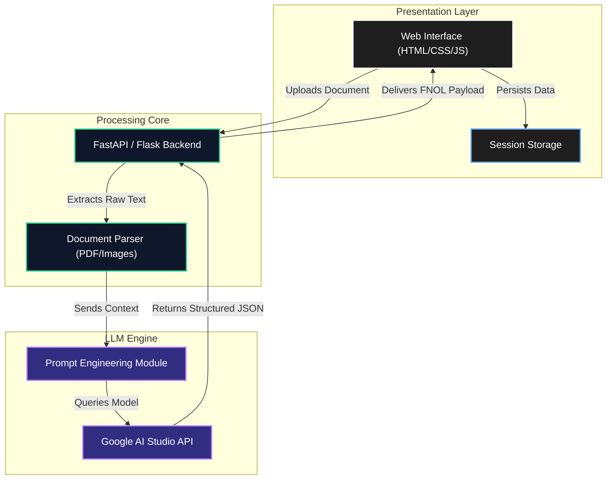

<div align="center">
  <h1><strong> Autonomous Insurance Claims Processing Agent</strong></h1>
</div>

<div align="center">
  
  
  
  
  
  
</div>

<br>

This agent is a state-of-the-art First Notice of Loss (FNOL) automation engine designed to drastically reduce manual overhead in the insurance lifecycle. By leveraging multi-modal LLM extraction pipelines, it ingests raw unstructured claims documents, maps them to strict deterministic JSON schemas, and dynamically calculates optimal processing routes (e.g., Fast-track, Specialist Queue). The architecture provides immediate, scalable document intelligence wrapped in an ultra-premium, zero-friction user interface.

---

## User Interface & Experience

| Component | UI Design Styling | Functional Highlight |
| :--- | :--- | :--- |
| **Monochrome Architecture** | Deep black `#000000` backgrounds with high-contrast `#ffffff` foregrounds and micro-animations. | Ensures hyper-focused readability and minimizes cognitive load during high-density data review. |
| **Dynamic Routing Badges** | Glassmorphic, translucent containers with contextual semantic highlighting. | Visually isolates the predicted decision route (e.g., green for Fast-track, red for Manual Review). |
| **Data Extraction Grid** | Flexbox-driven masonry layout with strict typography mapping and deterministic spacing. | Surfaces AI-extracted metadata instantly. Missing fields are injected with high-visibility bold red `NULL` identifiers. |
| **Interactive Code Viewer** | Greyscale-themed, syntax-highlighted block with horizontal scroll and DOM injection. | Allows developers and auditors to seamlessly inspect the raw, structured JSON response emitted by the LLM pipeline. |

---

## Technical Pillars & Key Features

| Technical Pillar | Technology | Functional Specification |
| :--- | :--- | :--- |
| **Deterministic Data Extraction** | Google LLM API / Prompt Engineering | Utilizes few-shot prompting to force the LLM to output valid, structured JSON without conversational hallucination. |
| **Intelligent Document Routing** | Logic Layer / Heuristics Engine | Calculates decision routes (Fast-track, Investigation, Specialist) based on parsed severity thresholds and missing data flags. |
| **Client-Side State Persistence** | JavaScript `sessionStorage` API | Persists the complex JSON payload and DOM state across browser reloads, guaranteeing zero data loss during user sessions. |
| **Zero-Dependency Frontend** | Vanilla CSS3 / ES6 JavaScript | Built strictly without heavyweight frameworks (No React/Vue). Employs CSS Variables (`:root`) for instant, cascading theme manipulation. |

---

## System Architecture



---

## 📂 Project Directory Structure

```ascii
Autonomous-Agent/
├── app/                        # Backend Application Core
│   ├── prompts/                # LLM System Prompts
│   │   └── extraction_prompt.txt
│   ├── services/               # Core Logic & Utilities
│   │   └── pdf_reader.py       # OCR & PDF Parsing Engine
│   ├── config.py               # Environment & Global Configurations
│   └── main.py                 # API Entrypoint
├── static/                     # Static Assets
│   ├── css/
│   │   └── style.css           # Global Stylesheet & Glassmorphism UI
│   └── js/
│       └── main.js             # Client-side Logic & DOM Manipulation
├── templates/                  # View Templates
│   └── index.html              # Main Single-Page Application (SPA)
├── .env.example                # Template for Environment Variables
├── .gitignore                  # Git Ignored Files
├── requirements.txt            # Python Dependencies
└── README.md                   # Project Documentation
```

---

## Setup & Installation Guide

### Prerequisites
Ensure you have the following installed locally:
- Python 3.10+
- Git

### 1. Clone & Environment
```bash
# Clone the repository
git clone https://github.com/Levi9633/Autonomous-Insurance-Claims-Processing-Agent.git
cd Autonomous-Insurance-Claims-Processing-Agent

# Create and activate a virtual environment
python -m venv venv
source venv/bin/activate  # On Windows: venv\Scripts\activate

# Install dependencies
pip install -r requirements.txt
```

### 2. Configuration
```bash
# Copy the environment template
cp .env.example .env
```
Open the `.env` file and insert your required API keys (e.g., `GOOGLE_API_KEY`).

### 3. Booting Local Development Server
```bash
# Run the application (using Uvicorn/FastAPI or Flask)
uvicorn app.main:app --reload
# OR for Flask: python app/main.py
```
The application will be accessible at `http://127.0.0.1:8000`.

---

## Verification and Testing

To ensure the environment is configured properly and the LLM pipeline is active, run the test suite:

```bash
# Execute unit tests for the PDF parser and prompt construction
pytest tests/

# Expected Output:
# ===================== test session starts =====================
# collected 12 items
# tests/test_pdf_reader.py ....                           [ 33%]
# tests/test_extraction.py ........                       [100%]
# ====================== 12 passed in 1.4s ======================
```

You can also run a manual validation check by uploading a sample PDF claim document through the UI and verifying that the `Fast-track` or `Manual Review` status correctly highlights missing parameters via the `.null-value` red injection.
